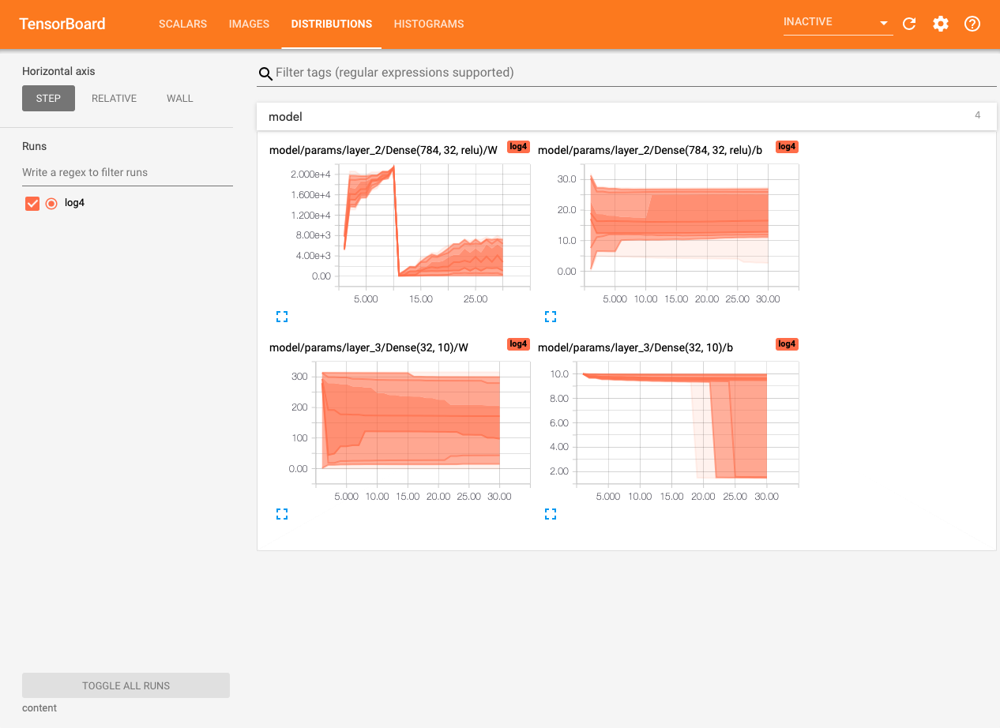
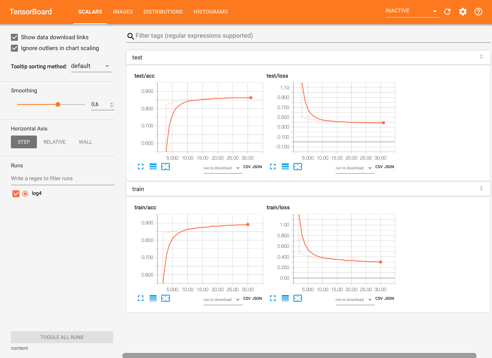

# Using TensorBoard with [Flux](https://fluxml.ai)
For a Google Colab version of this example, go [here](https://colab.research.google.com/drive/1xfUsBn9GEqbRjBF-UX_jnGjHZNtNsMae)
The most important part of the example is the callback `TBCallback` which
handles logging to TensorBoard.

!!! note
    This example necessitates a GPU and it will run for a couple of minutes.
    You could simplify it but... well. I'm lazy.

```julia
using TensorBoardLogger
using Flux
using Logging
using MLDatasets: FashionMNIST
using Statistics
using CuArrays

# Create tensorboard logger
logger = TBLogger("content/log", tb_overwrite)

# Load data
traindata, trainlabels = FashionMNIST.traindata();
testdata, testlabels = FashionMNIST.testdata();
trainsize = size(traindata, 3);
testsize = size(testdata, 3);

# Log some images as samples (not needed)
with_logger(logger) do
    images = TBImage(traindata[:, :, 1:10], WHN)
    @info "fmnist/samples" pics = images log_step_increment=0
end

# Create a FFNN model
model = Chain(
    x -> reshape(x, :, size(x, 4)),
    Dense(28^2, 32, relu),
    Dense(32, 10),
    softmax
)

loss(x, y) = Flux.crossentropy(model(x), y)

accuracy(x, y) = mean(Flux.onecold(model(x) |> cpu) .== Flux.onecold(y |> cpu))

opt = ADAM()

# Load the training data
traindata = permutedims(reshape(traindata, (28, 28, 60000, 1)), (1, 2, 4, 3));
testdata = permutedims(reshape(testdata, (28, 28, 10000, 1)), (1, 2, 4, 3));
trainlabels = Flux.onehotbatch(trainlabels, collect(0:9));
testlabels = Flux.onehotbatch(testlabels, collect(0:9));

# Function to get dictionary of model parameters
function fill_param_dict!(dict, m, prefix)
    if m isa Chain
        for (i, layer) in enumerate(m.layers)
            fill_param_dict!(dict, layer, prefix*"layer_"*string(i)*"/"*string(layer)*"/")
        end
    else
        for fieldname in fieldnames(typeof(m))
            val = getfield(m, fieldname)
            if val isa AbstractArray
                val = vec(val)
            end
            dict[prefix*string(fieldname)] = val
        end
    end
end

# Callback to log information after every epoch
function TBCallback()
  param_dict = Dict{String, Any}()
  fill_param_dict!(param_dict, model, "")
  with_logger(logger) do
    @info "model" params=param_dict log_step_increment=0
    @info "train" loss=loss(traindata, trainlabels) acc=accuracy(traindata, trainlabels) log_step_increment=0
    @info "test" loss=loss(testdata, testlabels) acc=accuracy(testdata, testlabels)
  end
end

# Create minibatches
minibatches = []
batchsize = 100
for i in range(1, stop = trainsize÷batchsize)
  lbound = (i-1)*batchsize+1
  ubound = min(trainsize, i*batchsize)
  push!(minibatches, (traindata[:, :, :, lbound:ubound], trainlabels[:, lbound:ubound]))
end

# Move data and model to gpu
traindata = traindata |> gpu
testdata = testdata |> gpu
trainlabels = trainlabels |> gpu
testlabels = testlabels |> gpu
model = model |> gpu
minibatches = minibatches |> gpu

# Train
@Flux.epochs 15 Flux.train!(loss, params(model), minibatches, opt, cb = Flux.throttle(TBCallback, 5))
```

The resulting TensorBoard interface will be:
```bash
tensorboard --logdir content
```



